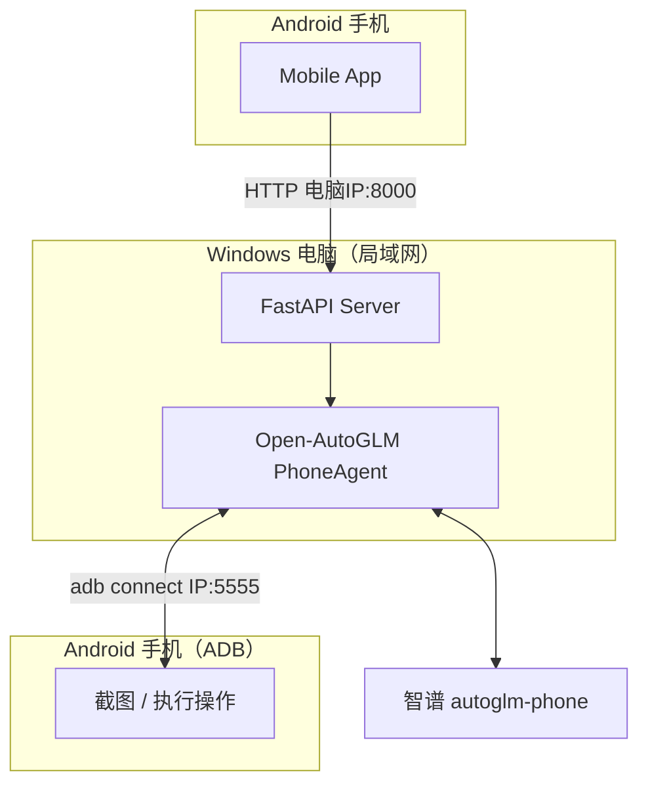

# AutoGLM Mobile Copilot (WiFi)

基于 [Open-AutoGLM](https://github.com/zai-org/Open-AutoGLM) 的手机 GUI Agent 项目。

在 Windows 电脑上运行 FastAPI 后端，通过同 WiFi 下的无线 ADB（`adb connect`）控制 Android 手机。手机 App 使用电脑的局域网 IP 访问后端，例如 `http://192.168.1.10:8000`。

## 相关仓库

| 版本 | 仓库 | 连接方式 |
| --- | --- | --- |
| USB | [USB-Autoglm-Mobile-Copilot](https://github.com/ginny-pjj/USB-Autoglm-Mobile-Copilot) | USB 数据线 + 本地后端 |
| **WiFi（本仓库）** | [WIFI-Autoglm-Mobile-Copilot](https://github.com/ginny-pjj/WIFI-Autoglm-Mobile-Copilot) | 同 WiFi 无线 ADB + 本地后端 |
| Cloud | [CLOUD-Autoglm-Mobile-Copilot](https://github.com/ginny-pjj/CLOUD-Autoglm-Mobile-Copilot) | 云服务器 + 远程 ADB |

系列说明见 [USB 仓库 SERIES.md](https://github.com/ginny-pjj/USB-Autoglm-Mobile-Copilot/blob/main/SERIES.md)。

---

## 系统架构



与 USB 版的区别：不使用 `adb reverse`，App 必须填写电脑的局域网 IP，不能填 `127.0.0.1`。

---

## 功能

| 模块 | 说明 |
| --- | --- |
| Mobile App | 配置局域网地址、提交任务、Mock/Real、Trace |
| FastAPI | 任务 API 与日志清洗 |
| 无线 ADB | `adb connect 手机IP:5555` |
| Open-AutoGLM | 官方 Phone Agent 内核 |

---

## 环境要求

- Windows 电脑 + Python 3.10+
- 手机与电脑在同一 WiFi
- 手机开启无线调试
- 智谱 API Key、ADB Keyboard（建议）

不需要云服务器或 Docker。

---

## 快速开始

### 1. 环境变量

```text
server/.env.example  →  server/.env
```

### 2. 启动后端

```cmd
server\start_server.bat
```

### 3. 无线连接手机

首次通常需 USB 执行一次：

```cmd
adb tcpip 5555
```

同一 WiFi 下：

```cmd
set PHONE_IP=192.168.x.x
server\connect_phone_wifi.bat
```

### 4. 配置 App

```text
http://电脑局域网IP:8000
```

---

## 演示视频

[GitHub Releases](https://github.com/ginny-pjj/WIFI-Autoglm-Mobile-Copilot/releases)

---

## 文档

- [快速开始](docs/quick-start.md)
- [架构说明](docs/architecture.md)
- [phone_agent 目录对照](docs/phone_agent-目录对照.md)
- [常见问题](docs/faq.md)

---

## 致谢

基于 [zai-org/Open-AutoGLM](https://github.com/zai-org/Open-AutoGLM)，遵循上游 License。
