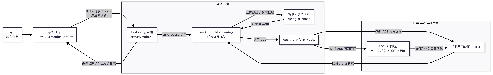

# WiFi 版系统架构



## 1. 总体调用链

```text
手机 App
  → http://电脑局域网IP:8000
  → Windows 本地 FastAPI Server
  → Open-AutoGLM main.py
  → PhoneAgent.run(task)
  → 截图 / 模型决策 / WiFi ADB 执行
  → 真实 Android 手机
```

WiFi v1 的核心：电脑跑后端，手机与电脑同 WiFi，通过 `adb connect 手机IP:5555` 无线连接，App 用电脑局域网 IP 访问后端。

## 2. 分层说明

| 层 | 位置 | 作用 |
| --- | --- | --- |
| 移动端 | `mobile-app/App.tsx` | 输入任务、配置 `http://电脑IP:8000`、展示 Trace |
| 本地 API | `server/main.py` | 任务接口、状态管理、调用 Open-AutoGLM |
| 启动脚本 | `server/start_server.bat` | 启动 FastAPI |
| WiFi 脚本 | `server/connect_phone_wifi.bat` | 无线 ADB 连接与检查 |
| Agent 入口 | `Open-AutoGLM/main.py` | 检查设备、键盘、API，启动 PhoneAgent |
| Agent 主循环 | `Open-AutoGLM/phone_agent/agent.py` | Observe → Think → Act |
| 动作执行 | `Open-AutoGLM/phone_agent/actions/handler.py` | Launch、Tap、Type、Swipe 等 |
| 设备控制 | `Open-AutoGLM/phone_agent/adb/` | 截图、输入、点击、无线 ADB |

## 3. Real 模式执行流程

```text
POST /tasks { task, mode: real }
  → App 经局域网访问电脑后端
  → 检查 API Key、Open-AutoGLM、无线 ADB 设备
  → 可选唤醒、解锁、回桌面
  → 启动 Open-AutoGLM 子进程
  → 截图 → VLM 决策 → WiFi ADB 执行 → 循环
  → finish 或超时后返回
```

## 4. 运行条件

| 条件 | 说明 |
| --- | --- |
| Windows 电脑 | 运行后端 |
| 同一 WiFi | PC 与手机同局域网 |
| 无线调试 | 手机开启无线 ADB |
| 智谱 API Key | 模型推理必需 |

## 5. 与 USB / 云端版对比

| 项目 | WiFi v1 |
| --- | --- |
| 后端位置 | 本地电脑 |
| 手机连接 | WiFi ADB |
| App 地址 | `http://电脑IP:8000` |
| 需要云服务器 | 否 |
| 电脑要一直开 | 是 |

## 6. 答辩一句话

> WiFi v1 是项目的无线调试阶段：在同一 WiFi 下用官方 remote ADB 能力控制真实手机，并用 App 可视化 Agent 执行过程。
